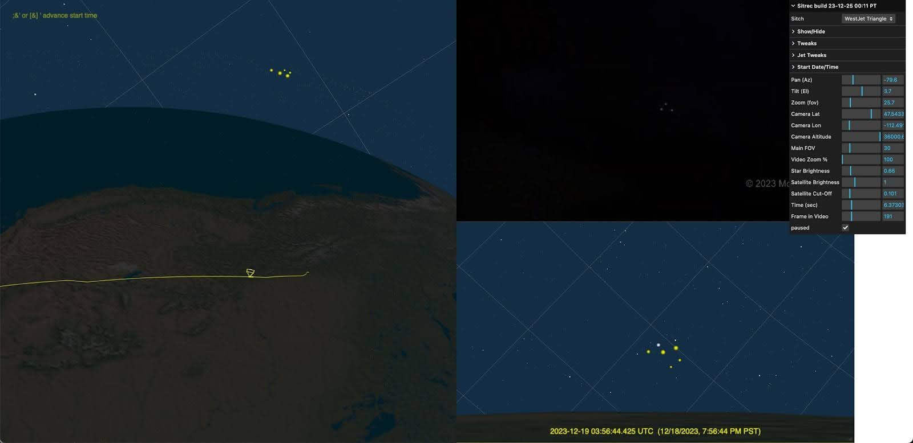

# Sitrec


Sitrec (Situation recreation) is a web application that allows for the real-time interactive 3D recreation of various situations. It was created initially to analyze the US Navy UAP/UFO video (Gimbal, GoFast, and FLIR1/Nimitz), but has expanded to include several other situations (referred to as "sitches"). It's written mostly by [Mick West](https://github.com/MickWest), with a lot of input from the members of [Metabunk](https://www.metabunk.org).

It's free and available to anyone. Here's a link to [Sitrec on Metabunk](https://www.metabunk.org/sitrec).

My goal here is to create a tool to effectively analyze UAP/UFO cases, and to share that analysis in a way that people can understand it. Hence, I focused on making Sitrec run in real-time (30 fps or faster), and be interactive both in viewing, and in exploring the various parameters of a sitch.  

### User Documentation [_NEW_]

- [The Sitrec User Interface - How the menus work](docs/UserInterface.md)
- [The Custom Sitch Tool - Drag and Drop Sitches](docs/CustomSitchTool.md)
- [Custom Models and 3D Object - add your own planes](docs/CustomModels.md)


### Technical Documentation (for coders and webmasters)

- [Local custom Sitch with JSON files - More complex cusom sitches](./docs/LocalCustomSitches.md)
- [File Rehosting and Server Configuration](./docs/FileRehosting.md)
- [Custom Terrain and Elevation Sources, WMS, etc.](docs/CustomTerrainSources.md)

The most common use case is to display three views:
- A video of a UAP situation 
- A 3D recreation of that video 
- A view of the 3D world from another perspective (with movable camera) 
- Plus various graphs and stats. 

Here's the [famous Aguadilla video](https://www.metabunk.org/sitrec/?sitch=agua)


Sitrec uses or ingests a variety of data sources

- ADS-B files in KML format from ADSB Exchange, FlightAware, Planefinder, and others
- TLE files in Two or Three Line Element format (for satellites, mostly Starlink)
- Star catalogs (BSC, etc.)
- Video (mp4, limited support)
- DJI Drone tracks from Airdata as .csv
- GLB (Binary GLTF 3D models)
- Generic custom data in .csv
- MISB style 3d Track data in KLV or CSV format
- Image files (jpg, png, etc)
 
Some types of situations covered:

- UAP Videos
  - Taken from a plane where a target object's azimuth and elevation are known ("angles only")
  - Taken from a plane of another plane
  - Taken from a plane looking in a particular direction
  - From a fixed position
- Viewing the sky (with accurate planets and satellites)

## Installation Prerequisites

- web server (e.g. Nginx) with
  - php
  - https support (for CORS, can be self-signed for local dev)
- node.js (for building, with npm)

## Simple install Mac/Linux

Assuming we want to install the build environment in sitrec-test-dev and the local server environment is a folder sittest.

```bash
git clone https://github.com/MickWest/sitrec sitrec-test-dev
cd sitrec-test-dev
cp config.js.example config.js
cp config-install.js.example config-install.js
cp .env.example .env
cp sitrecServer/config.php.example sitrecServer/config.php
```

Assuming you want to install in a folder called "glass" that's off the root of your local web serve

```bash
mkdir /Users/mick/Library/CloudStorage/Dropbox/Metabunk/glass
cd /Users/mick/Library/CloudStorage/Dropbox/Metabunk/glass
mkdir sitrec
mkdir sitrec-cache
mkdir sitrec-upload
mkdir sitrec-videos
```

Edit config-install.js
Set dev_path to /Users/mick/Library/CloudStorage/Dropbox/Metabunk/glass/sitrec
Set prod_path to any folder you can use for staging the deploy build (if needed)

Install all needed node modules
```bash
npm install
```

Build into the local web folder we defined earlier
```bash
npm run build
```

## Simple Install Windows


```bat
git clone https://github.com/mickwest/sitrec sitrec-test-dev
cd sitrec-test-dev
copy config.js.example config.js
copy config-install.js.example config-install.js
copy .env.example .env
copy sitrecServer\config.php.example sitrecServer\config.php
```

Assuming you want to install in a folder called "glass" that's off the root of your local web serve

```bat
mkdir c:\\nginx\\html\\glass
pushd c:\\nginx\\html\\glass
mkdir sitrec
mkdir sitrec-cache
mkdir sitrec-upload
mkdir sitrec-videos
popd
```

Edit config-install.js
Set dev_path to the local deployment folder on the web server
Set prod_path to any folder you can use for staging the deploy build (if needed)

Example:
```javascript
module.exports = {
    dev_path: 'c:\\nginx\\html\\glass\\sitrec',
    prod_path: 'c:\\users\\mick\\sitrec-deploy'
}
```

Install all needed node modules
```bash
npm install
```

Build into the local web folder we defined earlier
```bash
npm run build
```


## Code overview
Sitrec runs mostly client-side using JavaScript and some custom shaders but also has a handful of server-side scripts written in PHP. 

The rendering code uses Three.js, and there are a variety of other open-source libraries. All this uses MIT licenses or similar. 

The code cannot be run directly, as it is set up to be compiled using WebPack.

## Install local dev environment

Assuming that you want to run the code on a local machine for development, testing, etc, you need a web server. I use Nginx, but Apache should work
The web server should be configured to run php files (i.e. php-fpm)
It should also load an index.html file when there's one in the directory (this is usually default)

You will also need to install node.js in you build environment, from:
https://nodejs.org/en/download

Node.js is used both for build tools (i.e. webpack) and for packages used by the app. It is not used server-side. 

## Create Source file and sitrec project folder structure
Sitrec is built from the "sitrec" project folder. Note this is NOT the same "sitrec" server folder you deploy to.  

Clone Sitrec from GitHub, or download a release archive. This will give you the sitrec project folder with these sub-folders:
- `data` - per-sitch data like ADS-B data, csv files, TLEs, models, sprites, and images
- `docs` - other .md format Documentation and images
- `sitrecServer` - The server-side PHP files, like cachemaps.php
- `src` - The JavaScript source, with the entry point of index.js
- `three.js` - The 3D engine, the largest library used
- `test` - Test files for the console build
- `tests` - Unit tests that can be run by Jest

Then there are the project build files:
- `package.json` - top-level descriptor, contains npm scripts for build and deploy. It also contains the devDependencies (node modules that are used)
- `webpack.common.js` - the main configuration file for Webpack. The next two files both include this. 
- `webpack.dev.js` - used for development
- `webpack.prod.js` - used for production/deployment
- `config.js` - Contains install-specific constants for server paths used by the app
- `config-install.js` - development and production file paths, used by the build system

(config.js and config-install.js are initial supplied as config.js.example and config-install.js.example - you will need to rename them).

## Create the local (and production) server folder structure
Sitrec can exist at the server root, or in any path. I use the root, but it's maybe neater to have in a folder. Here I'll assume it's in a folder called "s". You do not have to use "s", you can put it in another folder, or in the web root (like I do)

There are five folders in the server structure
- `sitrec` - the folder containing the Webpack compiled app and the data files (except videos). This is deleted and recreated when rebuilding, so don't edit anything in there, edit the 
- `sitrec-config` - contains server-side PHP configuration files - you need to edit this. 
- `sitrec-cache` - a server-side cache for terrain tiles, initially empty
- `sitrec-upload` - for rehosting user files (like ADS-B or TLE). Initially empty
- `sitrec-videos` - The videos for the sitches. Handled separately as it can get quite large. The videos are subdivided into public (government or other unrestricted files) and private (where the licensing rights are unclear, but are used here under fair-use). So there's two sub-folders that you need to keep
  - `sitrec-videos/public`
  - `sitrec-videos/private`

Note sitrec-cache and sitrec-upload must have write permission.

There's also an optional URL shortener, which is uses a folder called 'u' to store HTML files with short names that are used to redirect to longer URLs.

## Download the videos

The private video folder contains videos taken by individuals and posted on the internet. I use them in Sitrec under fair-use, non-commercial, educational. But they are not included here. Ask me if you really need one. 
The public folder contain videos that are government produced, are by me, or are otherwise free of restrictions. They can be found here: https://www.dropbox.com/scl/fo/biko4zk689lgh5m5ojgzw/h?rlkey=stuaqfig0f369jzujgizsicyn&dl=0

## Create/Edit the config files
You will need to edit .env, config.js, config-install.js and sitrecServer/config.php

### sitrec/.env

See .env.example file for usage. 

### sitrec/config.js
This has the basic paths for both the local dev environment, and (optionally) the server environment 
For the dev environment, we need edits in two places:

```javascript
const SITREC_LOCAL = "http://localhost/s/sitrec/"
const SITREC_LOCAL_SERVER = "http://localhost/s/sitrec/sitRecServer/"
```
Then the server, the file has code which will attempt to determine SITREC_HOST from the environment. You might have to set it manually. There's comments in the file explaining this. 

config.js also has the localSituation variable which determines which sitch you boot up into in a local dev environment.


### sitrec/config-install.js

This tells Webpack where to put the built application. My setup is:

```javascript
dev_path: '/Users/mick/Library/CloudStorage/Dropbox/Metabunk/sitrec',
prod_path: '/Users/mick/sitrec-deploy'
```

`dev_path` is the path to the local server. Here `/Users/mick/Library/CloudStorage/Dropbox/Metabunk/` is the root of my local web server. A simple Windows configuration might be:

```javascript
dev_path: 'c:\\nginx\\html\\s\\sitrec',
prod_path: 'c:\\Users\\Fred\\sitrec-deploy'
```

## sitrec/sitrecServer/config.php

All the server configuration files have been consolidated into sitrecServer/config.php. It sets up
- the directory structure for the cache files
- Credentials for site like mapbox, amazon S3, space-data, etc
- Some flags and other setting

Read the comments in the file. There's a config.php.example file to use as a starting point

## Install the node modules

In sitrec there will also be a folder, node-modules. This is autogenerated by node.js from the package.json file. To create or update it, in the sitrec folder run 

```bash
npm install
```

This will create the folder node_modules, which will (currently) have 218 folders in it. These are the 24 packages that are used, plus their dependencies.  Note you won't be uploading this to the production server, as we use WebPack to only include what is needed.  You will need to do this when you get new code, but not during your own development. 

## Build the dev app with node.js and Webpack

In the sitrec _project_ folder, run 
```bash
npm run build
```

This will build the app in http://localhost/s/sitrec/, which mostly comprises 

```
index.html - the entry point
index.css - combined CSS
index.9a60e8af738fb4a9ce40.bundle.js (or similar, the name changes) - the code
/src/ - web worker code which is not included in webpack
/sitrecServer/ - the PHP server files
/data/ a copy of the /sitrec/data folder
Some .png files from jquery-ui (not important)
```

Since this is building (via dev-path) into the local server, the dev app will be at 

http://localhost/s/sitrec

## Testing

The following are URLS for tests of basic functions (these assume that the dev setup is in /s/). If they fail, first check the dev tools console to see if there's a helpful error message.

- [PHP Test](http://localhost/s/sitrec/sitrecServer/info.php)
Must display a PHP info page showing version number

- [Terrain elevation test](http://localhost/s/sitrec/sitrecServer/cachemaps.php?url=https%3A%2F%2Fs3.amazonaws.com%2Felevation-tiles-prod%2Fterrarium%2F14%2F3188%2F6188.png)
Test of the tile server proxy for terrain elevation. Should give a square image

- [Mapbox test](http://localhost/s/sitrec/sitrecServer/cachemaps.php?url=https%3A%2F%2Fapi.mapbox.com%2Fv4%2Fmapbox.satellite%2F16%2F20546%2F29347%402x.jpg80)
Returns an aerial tile of some buildings and trees:

- [OSM Test](http://localhost/s/sitrec/sitrecServer/cachemaps.php?url=https%3A%2F%2Fc.tile.openstreetmap.org%2F15%2F6382%2F12376.png)
Returns a segment of a street map

- [EOX Test](http://localhost/s/sitrec/sitrecServer/cachemaps.php?url=https%3A%2F%2Ftiles.maps.eox.at%2Fwmts%3Flayer%3Ds2cloudless_3857%26style%3Ddefault%26tilematrixset%3Dg%26Service%3DWMTS%26Request%3DGetTile%26Version%3D1.0.0%26Format%3Dimage%252Fjpeg%26TileMatrix%3D15%26TileCol%3D6383%26TileRow%3D12373)
Test of EOX landscape server - returns a brown aerial landscape tile

- [Landscape Test](http://localhost/s/sitrec/?sitch=swr)
A simple landscape, shows that the landscape proxy server is working

- [Default Sitch](http://localhost/s/sitrec/)
Will load the default local sitch set in config.js

- [Aquadilla Sitch](http://localhost/s/sitrec/?sitch=agua)
A more complex sitch with a video, landscape, tracks, and complex computations

- [Smoke Test](http://localhost/s/sitrec/?testAll=1)
A smoke test that loads ALL the sitches one after another

- [Quick Smoke Test](http://localhost/s/sitrec/?testAll=2)
  A smoke test that loads ALL the sitches one after another as quickly as possible

Failure could mean
- PHP-fpm not running
- php.ini missing extension=openssl
- s/sitrec-config/cachemaps-config.php is missing or bad
- s/sitrec-cache is missing or not writeable


## Production Build and Deploy

```bash
npm run deploy
```

This will build a production version of the code into the folder specified by prod_path in config-install.js

This is essentially the same as the dev version, except it's minified and has no debug info (file/line numbers, etc.) The minification means it takes a bit longer to build (for me build/dev is 3-4 seconds, and deploy/prod is about 15 seconds. YMMV)

The folder specified by prod_path here is arbitrarily named, it's just a temporary container for the production app and data before you transfer it to the production server. You can do that with FTP, ssh/rsync, or the deployment tool of your choice. I use rsync:

```bash
rsync -avz --delete -e "ssh " "$LOCAL_DIR/" "$REMOTE_USER@$REMOTE_HOST:$REMOTE_DIR
```
Before testing this, ensure you've got the five folders on the deploy servers, the same as on the local dev server. 

## Docker

`docker compose up -d` will start a container running the sitrec frontend and sitrecServer. By default, this will expose the service on `http://localhost:6425/`, without a basepath. To run on a different port, change the `ports` section of the `docker-compose.yml` file.

A default bind mount is set up for the `sitrec-videos` folder in the root of the project directory, allowing videos to be added. The `sitrec-cache` folder uses a volume by default, but can be changed to a bind mount by uncommenting a line in the `docker-compose.yml` file.

A Mapbox token can be provided by setting the `MAPBOX_TOKEN` environment variable in the `.env` file, see `.env.example`.

The rehosting & shortening functionality is not available in the docker container, as this depends on the Metabunk server.

## Adding A Sitch

### (The following approach has largely been replaced by setting up a custom sitch. See: [The Custom Sitch Tool - Drag and Drop Sitches](docs/CustomSitchTool.md))

A "sitch" is a situation - i.e. a scenario that is being recreated. Each sitch is defined by one Javascript file, and (optionally) some data files. 

To create a new sitch, the simplest way is to copy and rename an existing one that does something similar to what you want. So, for example, if you want to recreate a video of one plane being viewed from another plane, you could use the "Lake Michigan" sitch as a base.

Let's call the new stitch "Springfield" (just an example name), and assume you have KML files for the two planes, along with a location and time. 

- Copy sitch/SitLakeMichigan.js to sitch/SitSpringfield.js (Sitch files must start with "Sit")
- Edit three names at the start of the Sitch definition:
  - SitLakeMichigan -> SitSpringfield
  - "lakemichigan" -> "springfield" (lower case)
  - "Lake Michigan Tic-Tac" - > "Springfield window UAP"
- Add the two KML files to data/springfield
- Edit the `files` structure with the new files:
  - cameraFile = KML or SRT of where the video was filmed from
  - TargetTrack = KML file of the target plane (i.e. the suspected UAP)
- Add the video to /sitrec-videos/private/
- update the "videoFile" to point to this.
- Adjust the "startTime" to be the start time of the video. Note this is in Zulu time (UTC/GMT)
- Adjust "frames" to be the number of frames in the video
- Adjust or add "fps" to be the frames per second of the video (default is 30, typical values might be 24, 25, 29.97, 60, or 59.95)
- Adjust fov in lookCamera to match the vertical FOV of the camera (and lens/zoom) being used
- Adjust the lat/lon of the `terrain` descriptor, along with:
  - zoom: power of two zoom level, maximum 15
  - nTiles: the terrain will be a square with this many tiles on each side
- (Optional) `skyColor`: adjust the sky color

If you don't have a video, you can just remove references to one, but you'll still need to specify a number of frames (you can leave fps at 30)

For testing, you can either use a url denoting the sitch, like: 
https://www.metabunk.org/sitrec/?sitch=springfield
Or you can change the "localSituation" line in config.js
`const localSituation = "springfield";`

A sitch will generally have multiple views, each view has an id, specifically:
- **mainView** - The free camera 3D view of the world, so you can see what's going on
- **lookView** - The view in which we simulate the video
- **videoView** - The view that has the actual video


This is the preferred naming convention, but some older bits of code or comments might refer to lookView as the NAR view (as it was NAR mode on the ATFLIR system in the original "Gimbal" sitch)

The camera position is specified by two lines:
```javascript
startCameraPositionLLA:[42.647359,-86.678554,23575.039421],
startCameraTargetLLA:[42.653377,-86.670554,23235.005817],
```

These are LLA (Latitude, Longitude, Altitude in meters) positions. Note some sitches have the position specified as EUS local coordinates. LLA is preferred as the EUS coordinate system can change if you do things like adjust the resolution of the terrain.

Some legacy sitches specify the camera position in EUS coordinates (i.e. local x,y,z being East, Up, and South). This is not recommended, as it can change if you adjust the terrain resolution.

To get the camera position, just move it to where you want and then copy-and-paste the LLA lines from the debugger console output.  

To adjust the "views" (the on-screen rectangles that show something like a 3D view of the world, a video, an image, a graph, etc), you can add a view rectangle specifier for each one. For example:
```javascript
lookView: { left: 0.75, top: 0.35, width: -0.75, height: 0.65,},
videoView: { left: 0.5, top: 0.35, width: -0.75, height: 0.65,},
mainView: { left: 0.0, top: 0, width: 1, height: 1},
```

Positions and size are specified as a fraction of the screen's width and height
If one component (width or height) is negative, then that means it is a multiple of the other one. In the example above, we use a height of 0.65 of the window height, and then 0.75ths of that for the width. This ratio comes from the width and height of the video.  

Note in the above, mainView covers the entire screen (width:1), but it's also typical to limit it to half the screen (width:0.5). 

## EXAMPLE NEW SITCH: WestJet

Note: This was originally a sitch specified in code, but the same format is used for the dynamically loaded files that are parsed as text. This was in src/sitch/SitWestJet.js (as a code module), but is now in data/sitWestJet.js (as a text file)



```javascript
export const SitWestJet = {
    include_pvs14:true,
    name: "westjet",
    menuName: "WestJet Triangle",

    files: {
        starLink: "westjet/starlink-2023-12-18.tle",
        cameraFile: "westjet/FlightAware_WJA1517_KPHX_CYYC_20231219.kml",
    },

    videoFile: "../sitrec-videos/private/UAP Sighting by WestJet Passengers 12-18-23 16-05 clip.mp4",
    startTime: "2023-12-19T03:56:12.560Z",
    frames: 782,

    mainCamera: {
        fov: 30, near:1,  far:60000000,
        startCameraPositionLLA: [38.602145, -86.506588, 4159762.165337],
        startCameraTargetLLA: [38.603456, -86.509621, 4158895.037381],
    },
    lookCamera:{ fov: 10, far: 8000000 },
    cameraTrack: {},
    ptz: {az: -79.6, el: 0.6, fov: 25.7, showGUI: true},
    altitudeLabel:      { kind: "MeasureAltitude",position: "lookCamera"},
}
```
WestJet is a case of Starlink satellites observed from a plane. This new case was similar to the PVS14 sitch, so we use that as a base with the include_pvs14 line. 

The remaining lines show everything that needs to change

- files: 
  - starLink - a TLE file of all starlink satellites for the day in question
  - cameraFile - a KML file showing the timestamped path of the plane. 
- videoFile - the segment of the video we are interested in - reduced to 720p for speed
- startTime - the start time of the video. 
- frames - the number of frames in the video (which is the default 30 fps)
- mainCamera - definition of the main camera
  - startCamera... etc - the absolute position of the camera for the mainView (i.e. the world view on the left)
  - fov - the _vertical_ field of view of the mainView
  - near - near plane distance in meters (defaults to 1)
  - far - far plane distance in meters (defaults to 8000000. i.e. 8000km)
- lookCamera - definition of the look camera
  - fov, far, etc, same as mainCamera
- cameraTrack - creates a camera track, defaulting to one from cameraFile using startTime and frames for the interval.
- ptz - The Pan/Tilt/Zoom orientation of the camera
- altitudeLabel - a label with arrows showing the altitude of the camera. Note this is a new feature, and is not in the PVS14 sitch.

Note the views are not changed from PVS14, as it's a fairly standard landscape mode. 

