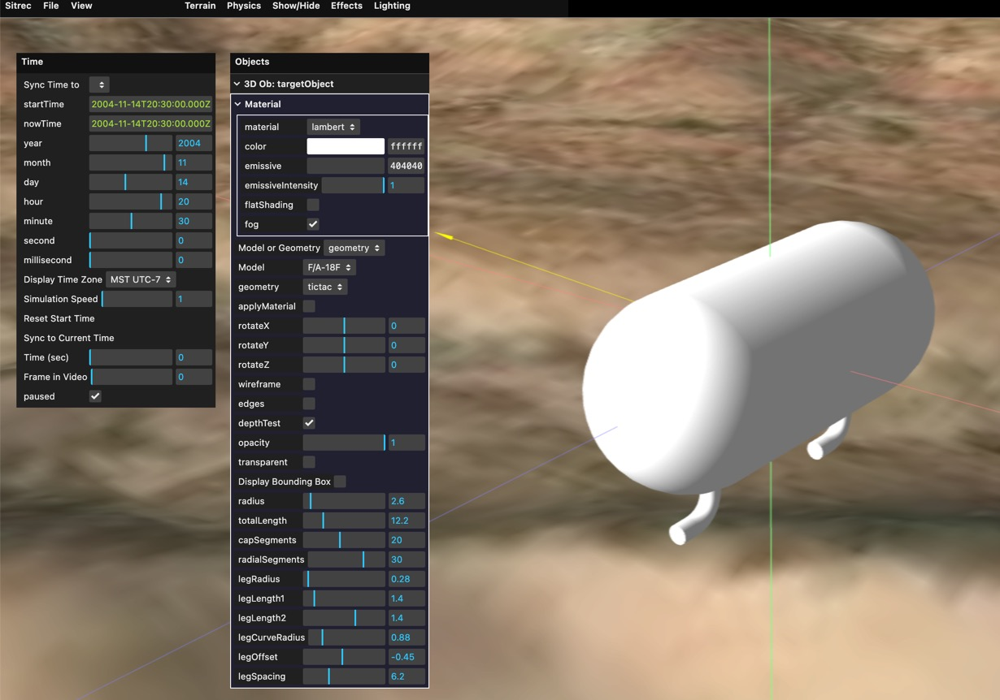
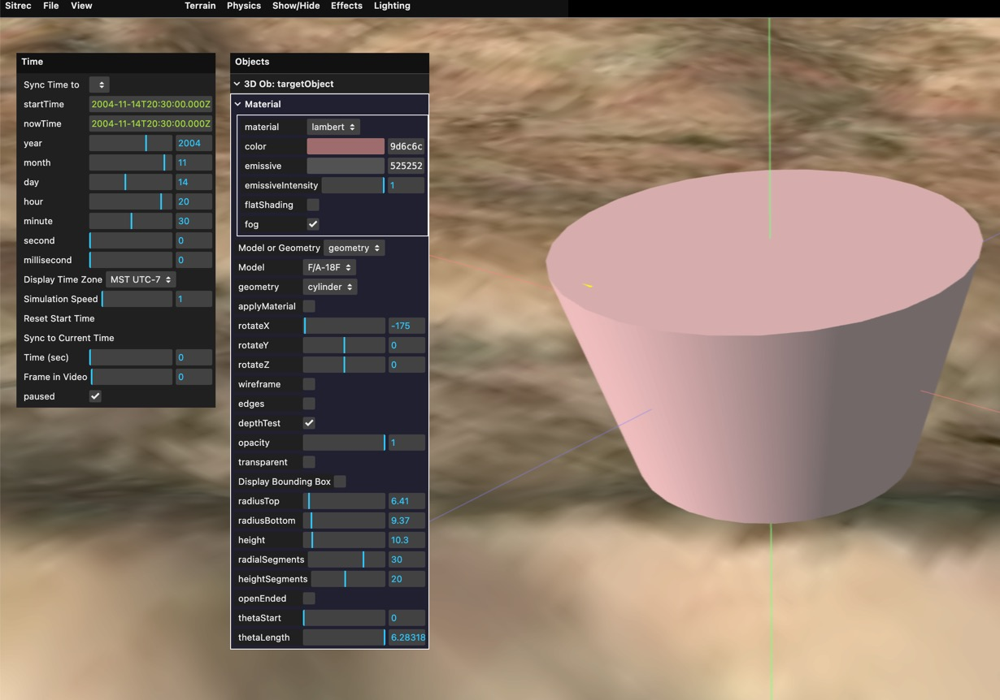
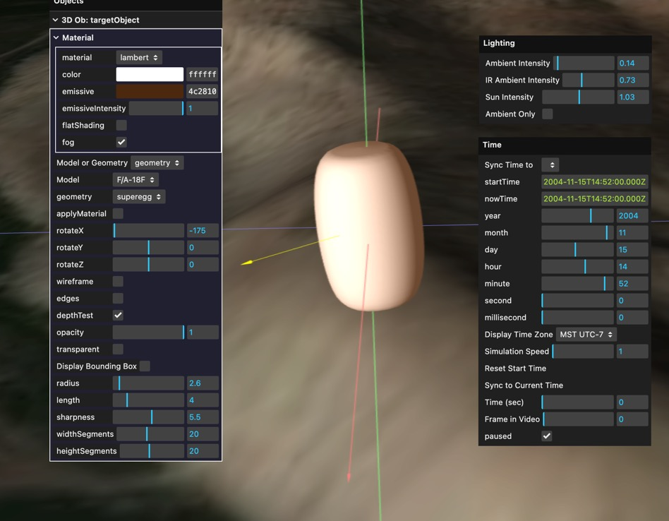
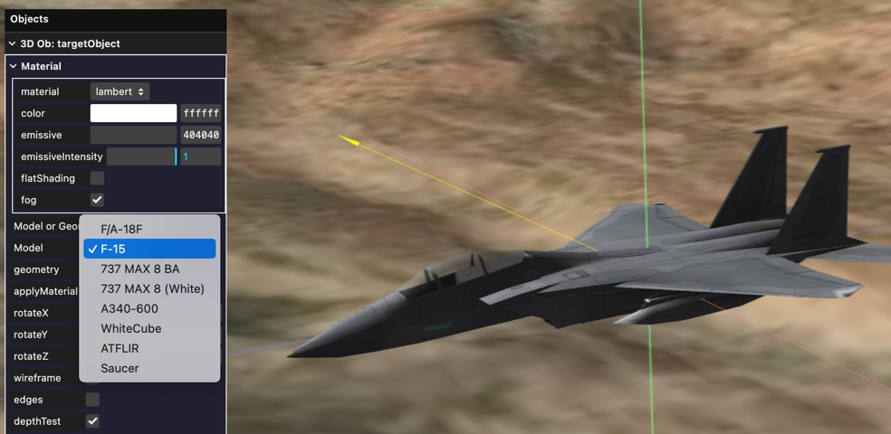
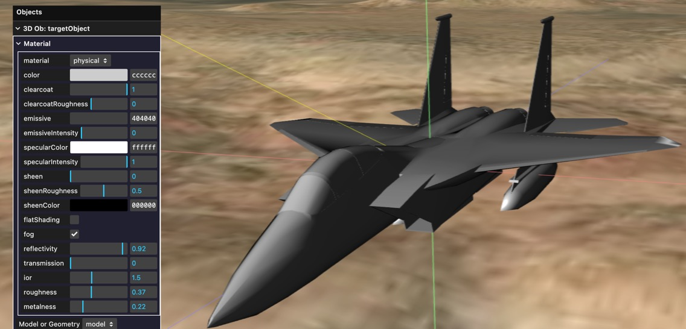
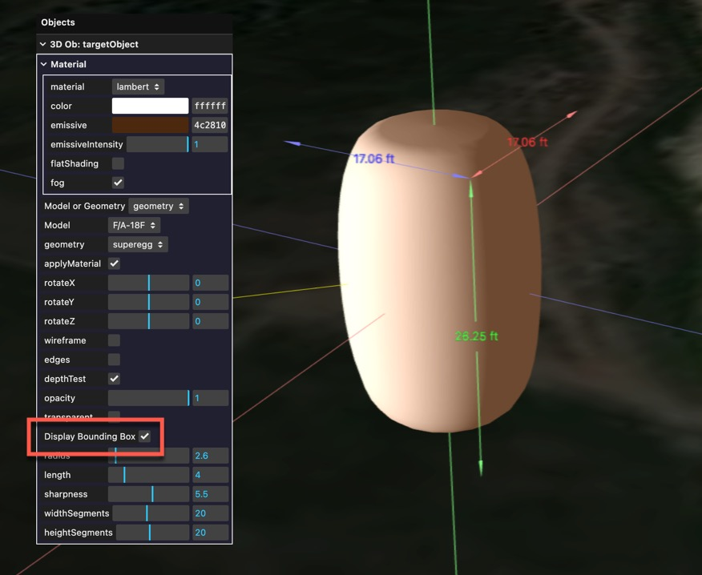
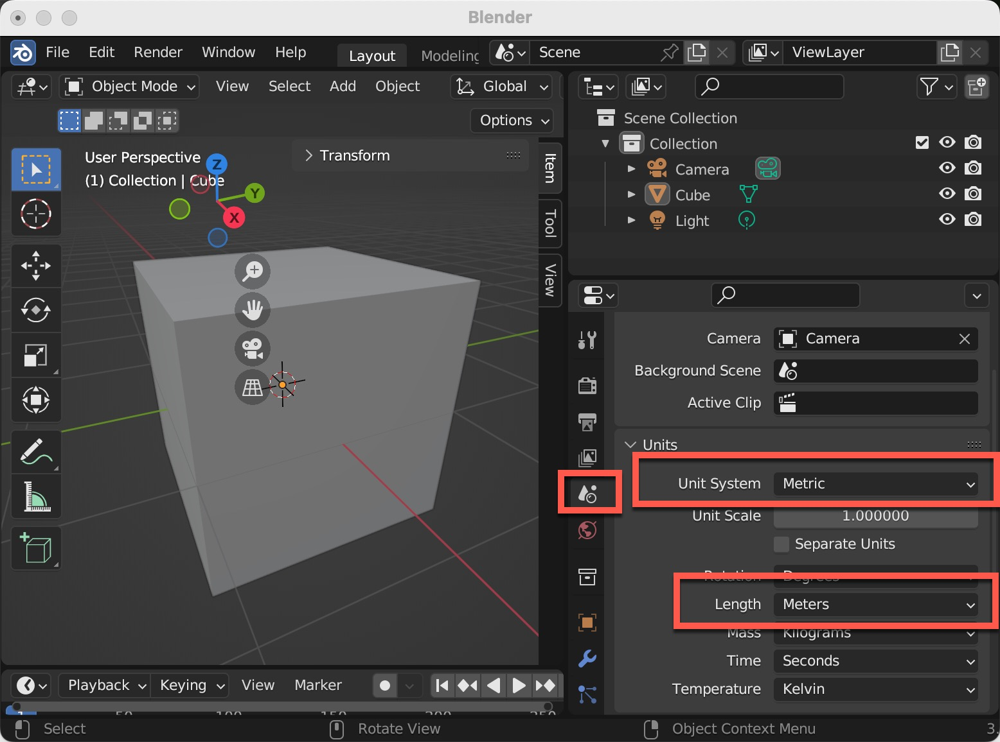
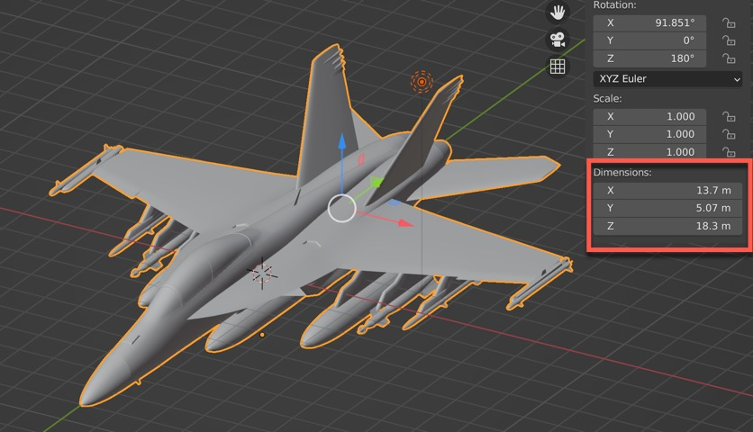
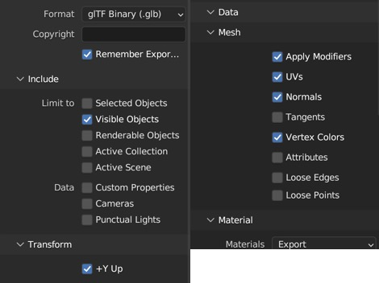

To simulate a potential UAP, Sitrec can display a variety of 3D models. There's some built-in, like planes and aerostats. You can also create simple geometric shapes like spheres and boxes. For full flexibility, you can import a custom 3D model. 

To experiment with this functionality, start with the model inspector, found at Sitrec->Tools->Model Inspector. 

Once in the Model Inspector, you will get the default object, and two views on that object. You can double-click on a view to make it full screen. 

Most of the object-specific adjsutments are done with the "Objects" menu. For convenience you can drag this off the menu bar to keep it open. Here I've also opened the "Time" menu, which is used for setting the sun direction.

With "Model or Geometry" set to "Geometry" you can experiment with a variety of different shapes.

You can also adjust the material (the surface appearance of the object). There are various different types.
- Basic: No lighting, the object will simply appear all the same color
- Lambert: Simple illumination where the object is affected by the sunlight. There's an additional color "emissive", which is how much light the object itself emits (i.e. if it's self-illuminating, like a lantern)
- Phong: Similar to Lambert
- Physical: A more physically realistic material, with more parameters. 

When experimenting with these settings, use the "Lighting" and "Time" menus to experiment with different lighting situations. For example, here's a very rough approximation of a lantern with an orange glow illuminated by low sun.

### Built-in Models

There are also some built-in models. To use them, change the mode from "geomtery" to "model" and select a model from the drop-down.

You can also apply the custom material to the object. This is a good way of quickly getting neutral color scheme. Here I'm using a physical material that's similar to the actual material, above. 

### Dimensions

The geometry specification are in meters. You can see the dimensions of the bounding box of an object by checking "Display Bounding Box" in the Object menu. This will display the dimensions in your default units (feet or meters).  

## Custom Models using Blender

The geometries are only intended for simple tests. For more flexibility you can create or import a custom model.  

Model are in OpenGL .glb format only. You don't need to use Blender to make them, but that's the only doumented pipeline. Other tools should be similar.

Internally, Sitrec used the metric system. So you need to set this in Blender if you want your models to be consistently sized.  

### Blender Orientation and scale

When creating a model, such as an aircraft, the forward direction should be along the negative y-axis. This makes it consistent with the OpenGL coordinate system used by Sitrec. In blender you can see the directions of the axes with the axes widget. RGB, Red, Green, and Blue are X, Y, and Z. 

The aircraft should be centered so its center of gravity is at the origin. This generally means the Y-axis will pass through the nose.

The aircraft should be level, as if it is wheels down. Angle of attack adjustments are done at run-time. This usually means the wings and horizontal stabilizers are level.

The size of the object can be seen in the bounding box dimensions. Ensure this matches expectations. The bounding box only works for single objects, so if your object is multi-parth then you'll have to use another method. 

### Blender materials 

Blender commonly uses the "Principled BSDF" material, an industry standard "physical" material which is largely supported in WebGL, and hence in Sitrec. For more details, see:
https://docs.blender.org/manual/en/2.80/addons/io_scene_gltf2.html

If you import a model from a format like FBX, Collada, or Wavefront/OBJ, you might need to adjust the material in Blender before exporting. If a material is opaque and you expected it to be transparent, then you might simply need to set the Blend Mode to "Alpha Blend"

### Blender Exporting

You will edit the model in Blender and save to a .blend file. But Sitrec requires .glb files, which are binary versions of glTF, including both geometry and materials in single file. 
To export a file, use File->Expoert-> glTF 2.0 (.glb/.gltf).

Click on "Remember Export Settings" and then ensure the following are set:

Then export the file. You should now be able to drag and drop this into the Sitrec model inspector, or any moddable sitch that supports it (e.g. FLIR1)

