# The Sitrec Custom Sitch Tool

Sitrec is a powerful tool that allows you to set up sitchs (situations) by either coding them directly, or by setting up a custom JSON file. 

Both those methods are powerful, but cumbersome. A simpler way that will work for many sitches is to use the _Custom Sitch Tool_.

The custom sitch tool is designed so you can simply import data (either via the "import" option on the file menu, or by dragging and dropping it directly into the browser window)

Before reading this, it's a good idea to familiarize yourself with the [User Interface](UserInterface.md) documentation. 

## Custom Sitch Basics

A Sitch is generally a recreation of a video involving a UAP (an unidentified object). As such there are some fundamental components

- The Camera Position
- The Camera Heading
- The Camera's field of view
- Other known object in the scene
- A potential UAP

The position of the camera, and the other known objects, is defined by a track. A track is just a list of positions at known times, sometimes with other data embedded in the same track, like where the camera is heading. 

To get a track into Sitrec, just import it (again, either via the "import" option on the file menu, or by dragging and dropping it directly into the browser window). The currently supported track formats are:

- KML or KMZ formatted ADS-B tracks. These are typically files exported from a flight tracking service such as FlightRadar24, Planefinder.nøet, FLightAware.com, or ADSB Exchange. 
- DJI drone data in CSV format. This has to be extracted from the encrypted data file using an online service. 
- CSV files. These currently need the relevant columns with headers matching the default MISB field names
- MISB KLV files. This is MISB data, typically embedded in a .TS video file. To import this into Sitrec, you need to convert it to KLV format, for example with ffmpeg (e.g. ffmpeg -i truck.ts  -map 0:1 -c copy -f data output.klv ). These files can vary in format. 

There are other ways a track can be created, for example from a file listing speed and bank angles of a plane over time. These are not currently supported in the Custom Sitch Tool as thye generally require custom code. 

(Sitrec is a work in progress, and I code largely around the data I have available. If there is a data format that is not supported that you have data available for, then I'd be happy to support it if you can give me the data. If you want it supported, but _can't_ give me the data, then that ,_might_ also be possible. Drop me a line: mick@mickwest.com )

# A Single Simple Track

So, you've got a track of a camera position, like an ADS-B track, just drag it in. You'll see something like this 
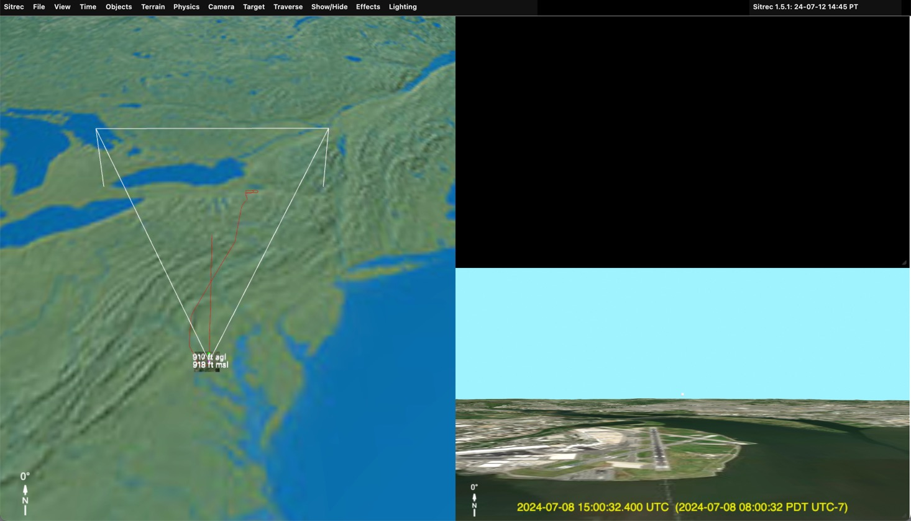

Sitrec will center the main view over the track you just loaded. The Look View will initialy be pointing North, but the the camera will be locked to the start of the track you just loaded. The terrain around the start point will also be loaded (that's the small patch visible)

If you zoom in you'll see more of the initial setup:
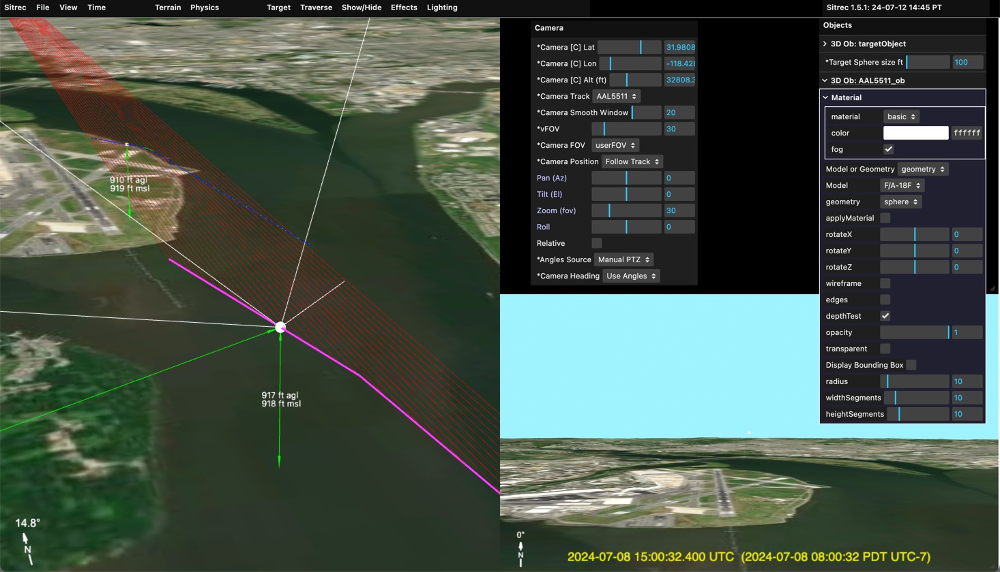

The Camera essentially has three sets of parameters: Position, Heading, and Field of View (FOV). You see these three listed in the Camera menu. Each one is a drop-down menu, becuase each one is a _data source_. 

By default when you load a single simple track (i.e. a track with no heading or FOV info ebedded in it), you get the following setup:

- Camera position: Follow Track - meaning the camera will move along the track you just loaded
- Camera FOV: userFOV - meaning you manually control the FOV with the slider above
- Camera Heading: Use Angles - meaning the heading will come from what is specified in "Angles Source". Since there no FOV data in the track, the only option there is "Manual PTZ"

### Camera Heading: Use Angles & PTZ

You can adjust the camera heading using the PTZ controls. These default to absolute values (the "Relative" check box is off). So a pan of 0° means north, and a tilt of 0° means level with the ground under the camera. A positive tilt goes up, negative goes down. 

Changing the PTZ mode to "Relative" (check the box) means that the heading is relative to the ground track of the jet. This allows you to simulate looking fowards (Pan = 0°), or to the pilot's left or right. 

In the above image you will see red lines. These are _lines of sight_ and essentially show where the plane's camera is looking. There's also a blue line, which is the _Traverse_ of the lines of sight. There are various ways of calculating a Traverse, but the default here is to stay a fixed distance from the camera. Mor on Traverses later. 

In addition there is the Traverse Object, which defaults to a cube. You can change this in the Objects menu. For eacmple if you wanted to simulate a plane flying 1NM to the pilot's left, you could change:

- PTZ to "relative"
- Pan to -90° (i.e. 90° left of the plane)
- Traverse Start Distance to 1NM
- Traverse Object "Object/Model or Geometry" to "Model"
- Model to "737 MAX 8 BA"

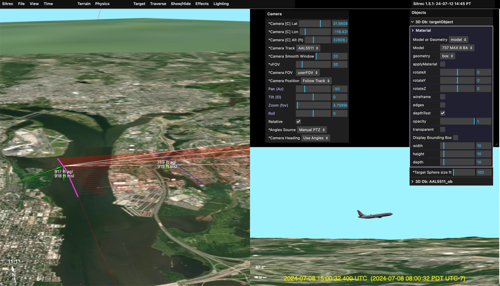

You might not see the plane in the main view, but if you zoom in it's there. 

### Camera Heading: To Target

The camera can also point towards a target. This can be fixed, or moving. A moving target would normally be another track (see later) but can also be set (in the Target menu) to "fixedTarget". You can then adjust the Latitude, Longitude and Altitude to a particular spot. This can be done by editing the numbers directly, or by holding down the "X" key while pointing at a spot on the ground. 

When moving the target (or, later, the camera) the altitude is kept constant. Press the Shift key in addition to "X" to snap the target to the ground. For example:
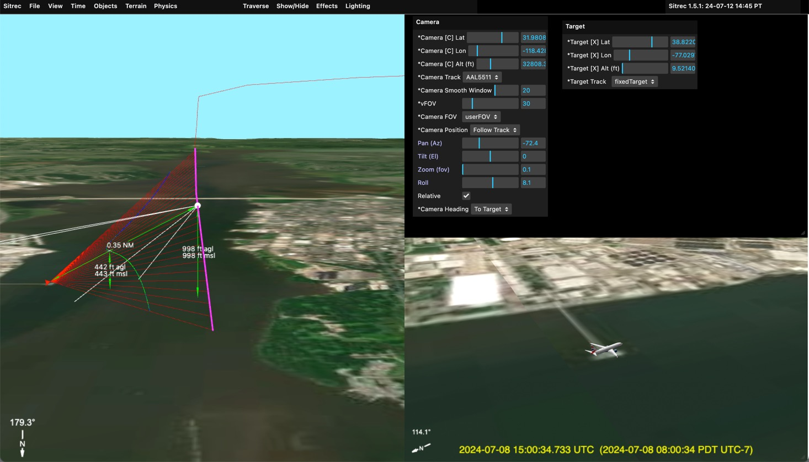
Here the target has been set to the end of the pier. The traverse object then appears between the pier and the camera. 

### Fixed camera

You can fix the camera to a particula point by selecting "fixedCamera" from the "Camera Track" dropdown.  You can leave the target fixed to create a static scene, or you can change the target track to the plane's track.

Example:
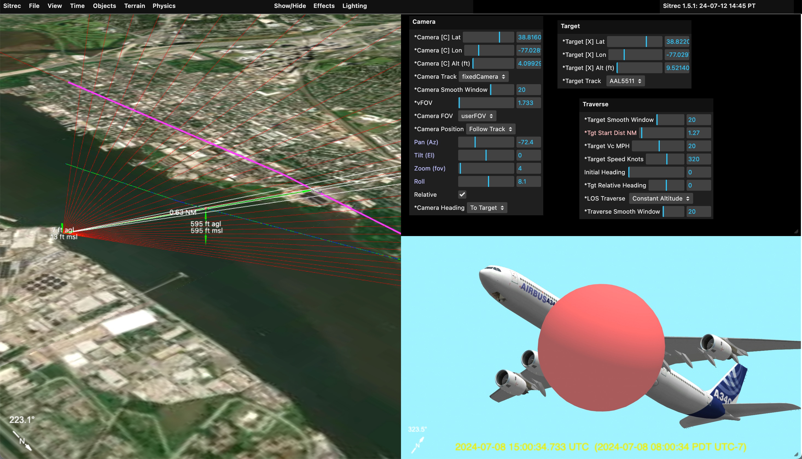

Here the camera is fixed on the ground, and the target track is set to the plane's track (AAL5511, the flight number). The traverse is set to "constant altitude" and the traverse object is set to a large red balloon. 

Note since the PTZ controls are disabled, you can now adjust the FOV with the "vFOV" slider in the camera menu. 

## Two Simple Tracks

The basic configurations above really become more powerful when you have two tracks (or a complex track, see later). With two tracks typically one will be the camera, and one will be the target (a potential UAP). 

To get two tracks into Sitrec, you can just drag them in. You can drag in two at once, but the order is important, so it's better to do them one at a time. The first track will be the camera track and the second will be the target track.  For example:
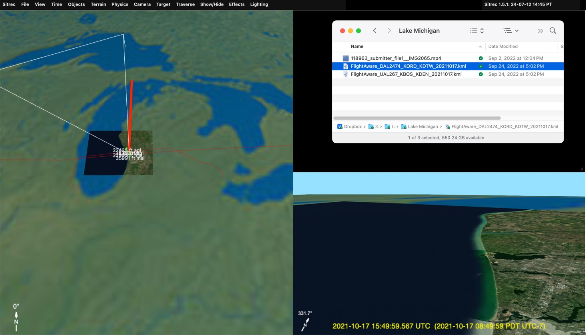
Here I dragged in two ADS-B tracks. Sitrec automatically calculates the closest point of approach, and uses that as the likely region of interest (you can change it if you want something else). Here the United flight is the one with the camera, looking down. The Delta flight, going in the opposite direction is the candidate UAP.

With the correct target set, we can add models, and zoom in. 
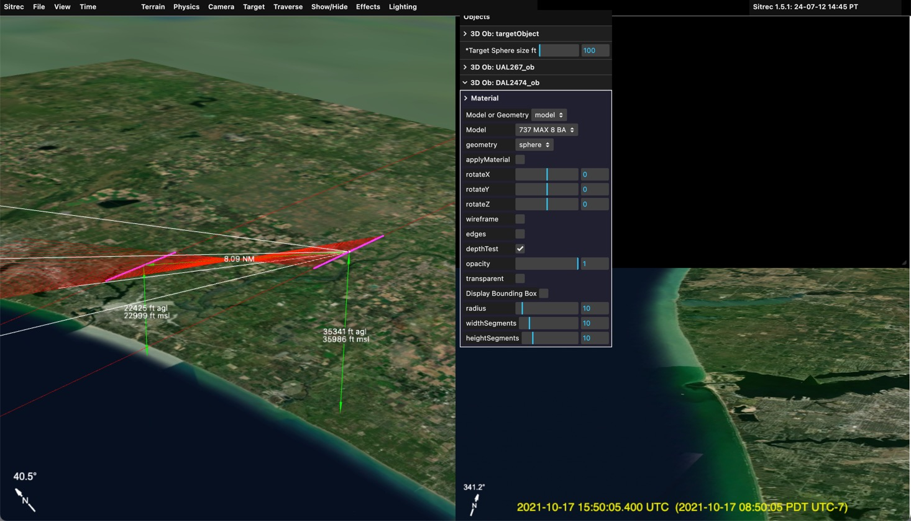

Here you can just barely see the 737 by the mouth of the estuary. This small Tic-Tac shape with no apparent wings is a common type of UFO reported. 

## Adding and Syncing Video

This situation has a video file as well as the ADS-B tracks. To load it, just drag it in (or file/import)
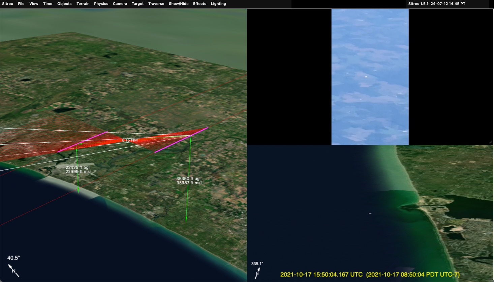
Note not all formats are supported. The best is to convert it to simple h264 .MP4 format with a constant frame rate. Currently the entire video file is loaded, so it best to keep it small, 720p or 480p, and no longer than is needed.

Here we see the "UAP" is similar in the look view and in the video, but the background is wrong. This is because we are simply using the time of the closest point of approach as our start time. That's not the actual start time of the video.

Complex videos (later) often have exact time code embedded. Here were have a simple video and two simple tracks, so we have to set the time manually. A good starting point is the time in the video file, but these times are often wrong or inaccurate. 

To sync the time manually, use the main slider to advance the the video to a distinctive point that will show up in the look view. 
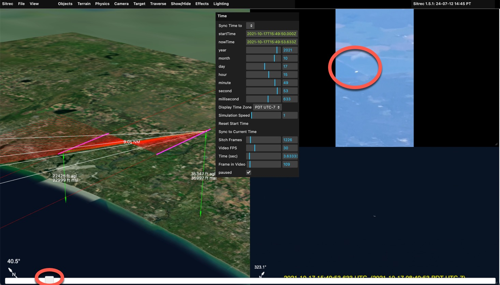
Here I moved it so the white object is over the boundry between to segments of a pond or reservoir. With that fixed, I now grab the "Seconds" or "Minutes" slider in the Time Menu and drag it until it matches. I also adjust the zoom, and fine tune the milliseconds
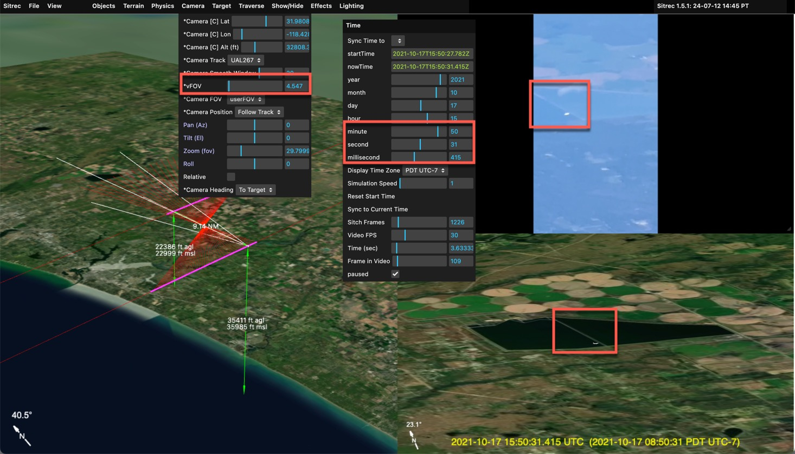

We now have an accurate recreation. With the time now synced you can scrub back and forth with the main slider and observer that the target lines up with other distinctive parts of the background 

With that you can adjust the effects to more closely match atmospheric, optical, and sensor effects. 
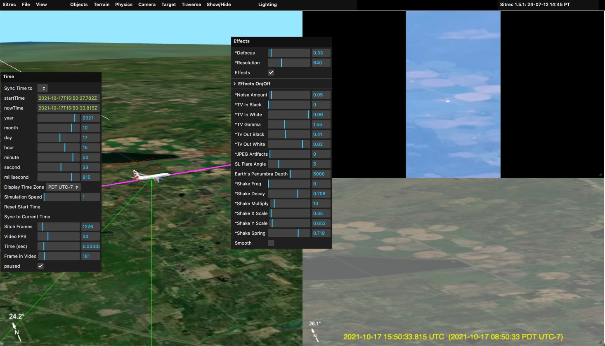

Here I bring in the Tv Out Black and White to simulate the haze. I also defocus slightly and reduced the resolution. 

Note in situation like this, the target is ofen darker than anticipated. That's due to the (current) lack of High Dynamic Range rending in Sitrec. 

## Complex Tracks and Video

Some platforms, like DJI or other drones, or commercial and military cameras, encode additional data besides the camera position. Typically this will include the direction the camera is pointing, possible a track of the ground positions below the cernter cross hairs, the field of view, and other things. 

The MISB format is commonly used in military and law enforcement applications, but is not widely used by the piublic. However MISB has a very rich data definition, covering everything you are likely to have in other formats. So I use MISB as an internal data representation. ADS-B tracks are converted to a MISB table (a spreadsheet) with just the position data. The DJI drone data contains FOV and heading data which likewise is converted into the relevant fields in an internal MISB table. 

Native MISB is also supported in either KLV or CSV formats. I don't have many examples to work with, so if you've got any you can share, I'd appreciate it. Mick@mickwest.com

### Using a single MISB-style complex track. 

In the scenario where we have a single complex track, we likely have a UAP that is being tracked by a plane or a drone. So we will have the position of the camera, and then the heading and elevation angles, as well as FOV. We might also have a center track, which is essentially the same as the angles, but is also generally more accurate. 

Complex video is the original video file. This may need splitting into a data file (.CSV or .KLV, or .BIN) and a video files (.MP4). Once this is split, drag them both into Sitrec. Example: 
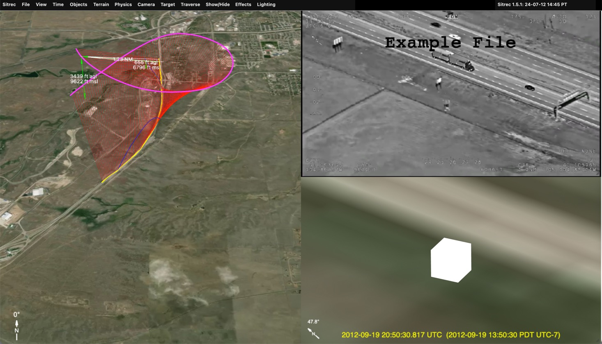

Here's what you see immediately after dragging in a MISB file (split in to a .KLV and a .MP4)