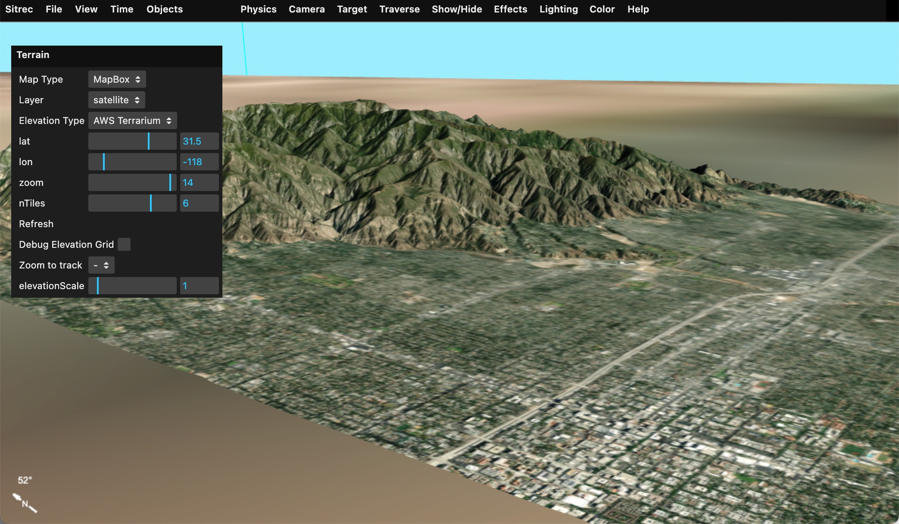

# Custom Terrain Sources

"Terrain" is the surface of the Earth. In Sitrec we normally just show a portion of the local terrain, specific to the sitch. For example:


Terrain is a in two parts, a "map" and "elevation." 

"Map" is the image used to render the map. i.e. the overhead image of the street, hills, desert, etc. 

"Elevation" is 3D shape of the ground, stored as an array of heights above sea level (elevations).

The source of this data can vary. Metabunk has a variety of options for these sources built in. If you create your own installation then you can add your own sources. This might be useful if you can't access sites like MapBox from your network, or if you have your own custom overlay that you would like to use. 

Sitrec has limited support for Web Map Service (WMS) and Web Map Service (WMTS) formats, as well as custom tile formats.

Map sources and elevation sources are configured with a map definition. These are stored per-install in config.js (see config-example.js). The simplest such sources just specify a name, and function that takes z,x,y tiles specifiers and returns the URL of a tile. 

Example: Open Streetmap:

```javascript
        osm: {
            name: "Open Streetmap",
            mapURL: (z,x,y) => {
                return SITREC_SERVER+"cachemaps.php?url=" + encodeURIComponent(`https://c.tile.openstreetmap.org/${z}/${x}/${y}.png`)
            },
        },
```

Here the function mapURL returns an OSM request combined with a Metabunk server cache request. Note there's no account token, which is needed for such a request. This is because it is added server-side, which requires additional configuration. Caching is done to protect the account token and to cache map and terrain tiles to avoid multiple requests in development. 

To access a map source directly you can include a request token that is specific to your server. For example, the metabunk Maptiler config is direct:

```javascript
        maptiler: {
            name: "MapTiler",
            mapURL: (z,x,y, layerName, layerType) => {
                return(`https://api.maptiler.com/tiles/${layerName}/${z}/${x}/${y}.${layerType}?key=cnVJFChj7wZSQz7jBJvR`); // key is metabunk specific - replace with your own
            },
        },
```

WMS and WMTS sources are specified in a similar way. Here's two working examples:

```javascript
        NRL_WMS: {
            name: "Naval Research Laboratory WMS",
            mapURL: function (z,x,y, layerName, layerType) {
                return this.mapProjection.wmsGetMapURLFromTile("https://geoint.nrlssc.org/nrltileserver/wms/category/Imagery?",layerName,z,x,y);
            },
            capabilities: "https://geoint.nrlssc.org/nrltileserver/wms/category/Imagery?REQUEST=GetCapabilities&SERVICE=WMS",
            layer: "ImageryMosaic",

        },

        NRL_WMTS: {
            name: "Naval Research Laboratory WMS Tile",

            mapURL: function (z,x,y,  layerName, layerType) {
                return this.mapProjection.wmtsGetMapURLFromTile("https://geoint.nrlssc.org/nrltileserver/wmts",layerName,z,x,y);
            },
            capabilities: "https://geoint.nrlssc.org/nrltileserver/wmts?REQUEST=GetCapabilities&VERSION=1.0.0&SERVICE=WMTS",
            layer: "BlueMarble_AUTO",
            mapping: 4326,

        },
```


A WMS map source usually returns a rectangle that covers a specific range of latitude and longitude. Since Sitrec expects regular sized tile, there's a simple mapping from tile coordinates to lat/lon extents of a tile. Doing it this way is not the most efficient, but essentially converts a WMTS tile request into the matching WMS request. The example above uses this utility function:

```javascript
    wmsGetMapURLFromTile(urlBase, name, z, x, y) {

        // convert z,x,y to lat/lon
        const lat0 = this.getNorthLatitude(y, z);
        const lon0 = this.getLeftLongitude(x, z);
        const lat1 = this.getNorthLatitude(y + 1, z);
        const lon1 = this.getLeftLongitude(x + 1, z);

        // if the urlBase does not end in a ?, then add one
        if (urlBase[urlBase.length-1] !== '?') {
            urlBase += '?';
        }

        const url =
            urlBase+
            "SERVICE=WMS&REQUEST=GetMap&VERSION=1.1.1" +
            "&LAYERS=" + name +
            "&FORMAT=image/jpeg" +
            "&CRS=EPSG:4326" +
            `&BBOX=${lon0},${lat1},${lon1},${lat0}` +
            "&WIDTH=256&HEIGHT=256" +
            "&STYLES=";

        console.log("URL = " + url);
        return url;

    }
```

That's in WMSUtls.js. You can use this, or you are free to add code to your config.js (I recommend just adding it there to simplify merging with later releases of Sitrec)

WMTS and WMS source have a "capabilities" parameter. This specifies a query that returns an XML file that describes the various layers that a server has to offer. The NRL sources in the example have multiple layers. 

You can specify the layer to used, like:
```javascript
            layer: "BlueMarble_AUTO",
```
Or leave that out and it will just use the first one. 

Tile sources can specify one of two mappings, which specify the projection of the map (Mercator, Equirectangular, etc). These use the EPSG number, and the default is EPSG:3857. Note the NRL WMTS example uses 4326.
```javascript
            mapping: 4326,
```

The above example are all for map sources (i.e. the textures or bitmaps used to cover the terrain). Elevation is currently more limited. 

The default terrain source used by Metabunk Sitrec is:
```javascript
    customElevationSources: {
        AWS_Terrarium: {
            name: "AWS Terrarium",
//            url: "https://s3.amazonaws.com/elevation-tiles-prod/terrarium/{z}/{x}/{y}.tif",
            url: "https://s3.amazonaws.com/elevation-tiles-prod/terrarium",
            maxZoom: 14,
            minZoom: 0,
            tileSize: 256,
            attribution: "AWS Terrarium Elevation Data",
        },

    }
```

This is a public domain EPSG:3857 tile source from MapZen that encodes elevation data into the RGB values of a PNG tile. See: 
https://registry.opendata.aws/terrain-tiles/


