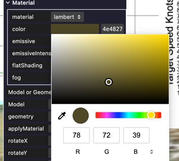
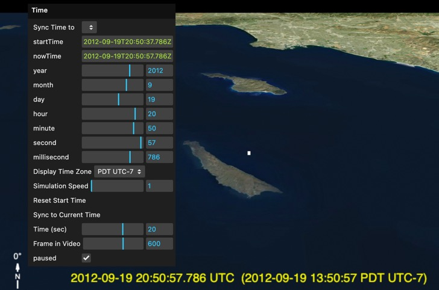

# Sitrec User Interface

Sitrec is a web application that will run in any popular desktop browser like Chrome, Safari, Edge, or Firefox. To run it you just enter or click on the URL of the installation. In this documentation I'll assume you are using the standard Metabunk installation 

# https://www.metabunk.org/sitrec/

## The Menu System

Sitrec's menus are similar to Mac/Windows menus in that there's a menu bar, and you can click on a menu to open or close it.

You can also drag the menu off the menu bar by clicking on the title (The name of the menu, e.g., "File"), and then dragging down. This will leave that menu open at the position you choose on screen. 

To re-dock a menu in the menu bar, either drag it to the top of the screen, or double-click on the title. 

## Folders

Some menus have folders - essentially a sub menu - that you can expand. For example, the Object menu has one folder per object, and each object folder has its own Material folder. 

## Sliders

Most values in Sitrec are edited via sliders. You can modify these in various ways:

- Dragging the slider will quickly adjust the value.
- Editing the number directly - click on the number and type in a new value
- Dragging the number _vertically_ will change it in small increments
- Clicking on the number and then using the up/down arrows will change the number in single steps

Most sliders will stop at the left or right minimum or maximum values, but some, such as the hours/minutes, etc., will wrap around and increment/decrement the slider above them. 

## Color Pickers

Color pickers let you edit the hex value of the color directly, or you can change the hue, saturation and intensity with the slider and the 2D color selector. You can also switch between RGB, HSL, and HEX inputs. Clicking on the eyedropper tool allows you to sample a color from anywhere on screen. 

## Views/Windows

In Sitrec the screen is divided into windows called "Views". Typically, this will consist of:

- Main View: the "god's eye view" looking down at the world
- Look View: the simulated view through the camera set to match the video
- Video View: the original video.
- Overlay Views: Various overlays, things like compasses, or simulated HUDs, like the ATFLIR, 
- Graph views: various graphs showing things like the speed and altitude of the proposed target object. 
- Editor views: things like spline editors used to make a custom curve for something like Azimuth or Bank Angle.
- Simulator views: Thinks like the simulated SA page in the Gimbal Sims. 

You can modify a view in various ways:

- Double-Click on a view to hide all the other views and make this one full-screen. 
- Under the Show/Hide->Views menu, you can toggle individual views on and off.
- Click and drag a view to move it on screen. You may have to hold down the shift key for this to work, as some views use the mouse for camera navigation. 
- Click and drag the corners or sides of a view to resize it. Again, you may have to hold down the shift key.

All these modification to the views will be saved when you "Export Custom/Mod"
 
# Time and Date User Interface

Sitrec is simulating a period of time. This time has a start time and a duration. There's three concepts of time that you need to understand in Sitrec:

## Frame Number/Time

A video has a total number of frames, and a specific number for frames per second (fps). A frame number can also be expressed as a time since the start of the video. The slider at the bottom of the screen represents the the frame. You can modify this in various ways:

- Drag the large slider
- Drag the "Time (sec)" or "Frame in Video" sliders in the "Time" menu (or adjust the sliders as described earlier)
- Hold the Left or Right arrows to advance time forwards or backwards at the normal rate.
- Hold the Up and Down arrows to advance time at 10x speed
- Tap < or > (the , and . keys) to single step on frame backwards or forwards. 
- On a video view, right drag in the window to scrub time

## Start Time and Now Time

Start Time is the time at which the video starts. i.e. it's the time at frame 0 (the first frame) of the video. Using the correct time is crucial to recreate a video. Often the start time comes from the video data, but you also might need to edit it manually to find a match.

Now Time is the time at the current frame in the video. Essentially it's the start time of the video plus the frame time. 

The Time menu shows both the start time and the now time at the top (yellow text). When the Frame Time is set to zero they will both be the same. 

The sliders for Year, Month, Day, etc. show the Now Time. This is because when you want to sync the simulation and the video, you will adjust the frame time until there's something distinctive on screen (such as two objects lining up), and then you will adjust the Start Time of the video so that the even happens at the right time in the simulation. This is conceptually simpler if you are editing the Now Time, because that's the point in time that's being displayed (the Start Time is automatically adjusted)

The look view displays the Now Time in UTC format and in the user-selected time zone. 

For time-lapse videos, you can adjust the simulation speed. 

## Navigating the Main View in 3D

The Main View is a 3D view on the world, very similar in concept to other 3D viewers like Google Earth. To move the camera around, you use the mouse

- Left Drag is like dragging the world around. The camera is what actually moves.   
- Right Drag tilts the viewpoint without moving the camera
- Center Drag rotates the camera around a point in the world
- The mouse wheel zooms in and out.

If you get lost, you can select "Reset Camera" from the View menu. This will put the camera back to the start position. In the custom sitch tool, it will put the camera back to the position calculated when you last imported a track. You can also get this by pressing "." on the numeric keypad. 

You can also set a default using "Snapshot camera".

# Changing the Terrain

Under the Terrain menu you can change "Map Type". This defaults to MapBox, but you can also choose a street map view. The Settings EOX, Wireframe, and RGB Test are not particularly useful, but EOX can be used if MapBox is not available - of if you just want a different satellite view time.  

There are more terrain editing options in the [Custom Sitch Tool](CustomSitchTool.md)

